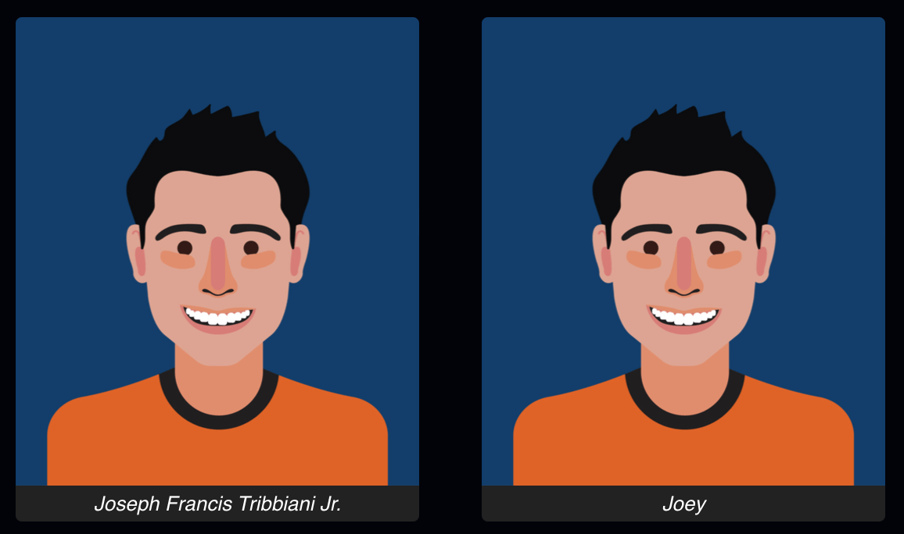

# 🎮 JS-Nation 2022 📺 🍿 🎬 📽
_Hello👋 there! Welcome to JS-Nation `Should we have business logic in the UI?` workshop. The propose of this document is to guide you our develop the steps of this workshop... <small>Good luck, ping Sam for any help 🔔.</small>_

<br/>

## 🪜 **Step 7** Instructions

### Step 7 - feat: Use short name as figure legend

**Feature requirements:**

At the moment, each character has his full name in the figure caption. This name is very verbose and makes players confused. The goal of this feature is to use the shortname instead.

<p align="center" width="100%">
  
</p>

###### Example: `Joseph Francis Tribbiani Jr.` -> `Joey`

<br/>
<br/>

1. Impress with your developer skills


> 👀 If you are facing difficulties on this step take a look at the [proposed solution](https://github.com/saribe/js-nation/commit/8502151fe26e06beac56f9dc005ff6b39dec73db).


<br/>
<br/>

## 💡 The general idea


> _Some decisions made may seam not obvious, but once you understand the concept you will see clearly the matrix._


This architecture will try to make you cry with it's [Onion Architecture](https://blog.avenuecode.com/domain-driven-design-and-onion-architecture), it is based on the inversion of control principle. It's composed of multiple concentric layers interfacing with each other towards the domain.

<p align="center" width="100%">
  
</p>

### Some hight level concepts and tips:
- Dependencies only point **inwards**. An inner layer **should never rely** on anything from an outer layer.
- _Web/UI_ is a **delivery mechanism**. **It is not the center.** it is external.
- The _Domain_ is **independent** of frameworks or libs.
- The _Application_ is **independent** of frameworks or libs.
- The _UI_ adopted the _react_ framework.
- Organize your code **around the business rules**, not frameworks.
- [Dependency rule](https://blog.cleancoder.com/uncle-bob/2012/08/13/the-clean-architecture.html#the-dependency-rule) Keep details away from the core.
- Make everything easy to **test**.


## ℹ️ Usage

```bash
# In the project directory, you can run:

npm start

# Runs the app in the development mode.\
# Open [http://localhost:3000](http://localhost:3000) to view it in the browser.

# The page will reload if you make edits.\
# You will also see any lint errors in the console.

npm test

# Launches the test runner in the interactive watch mode.\
# See the section about [running tests](https://facebook.github.io/create-react-app/docs/running-tests) for more information.

npm run build

# Builds the app for production to the `build` folder.\
# It correctly bundles React in production mode and optimizes the build for the best performance.

# The build is minified and the filenames include the hashes.\
# Your app is ready to be deployed!

# See the section about [deployment](https://facebook.github.io/create-react-app/docs/deployment) for more information.
```

## 🏗 Contributing

```javascript
throw new NotImplementedException();
```

## 🤔 Disclaimer

> Front-end development is software development.

> Nothing used here is _new_ or an attempt of creating a new framework.

> [DDD](https://en.wikipedia.org/wiki/Domain-driven_design) is business pattern created in 1970s to solve business problems, we are implementing a software solution to solve the business requirements of OLX. DDD was [introduced to the software](https://www.dddcommunity.org/book/evans_2003) industry in 2004.

> Object Oriented Programming ([OOP](https://en.wikipedia.org/wiki/Object-oriented_programming)) do not invalidate any of the other design patterns in place.

## 🧠 The mindset and ideology

- The UI is definitely important but not the main/only focus.
- Low coupling + high cohesion = THE GOAL.
- Keeping your domain pure (no libraries or frameworks dependencies) makes it easier to test, maintain, and iterate on.

